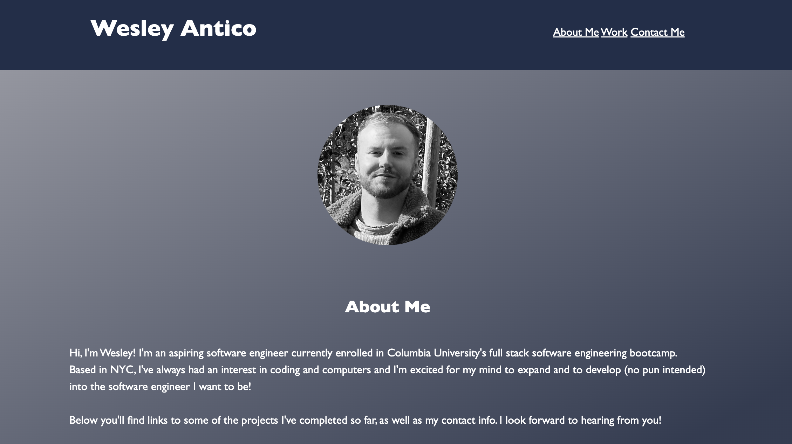

# My-Professional-Portfolio

## A portfolio webpage to showcase projects I have completed for potential employers. This page contains contact links to my email, phone number and Github profile for any potential employer to get in touch. The page also displays clickable image links to my projects so they can be viewed and interacted with.

## Installation

N/A

## Usage

To use this page, click the links in the navigation bar to go directly to the corresponding section on the page. Once in my 'Work' section, click on an image link to display and interact with one of my deployed projects. Additionally, scroll to my 'Contact Me' section and click on the GitHub link to view my Github profile with my project repositories. You can also click on the email link to contact me via email directly from the device you're using.

## Credits

Linear gradient background was created using code created at cssgradient.io
Image grayscale hover effect was created with code sourced from stackoverflow user 'stefets' at https://stackoverflow.com/users/5531345/stefets

## License

Please refer to the LICENSE in the repo.
